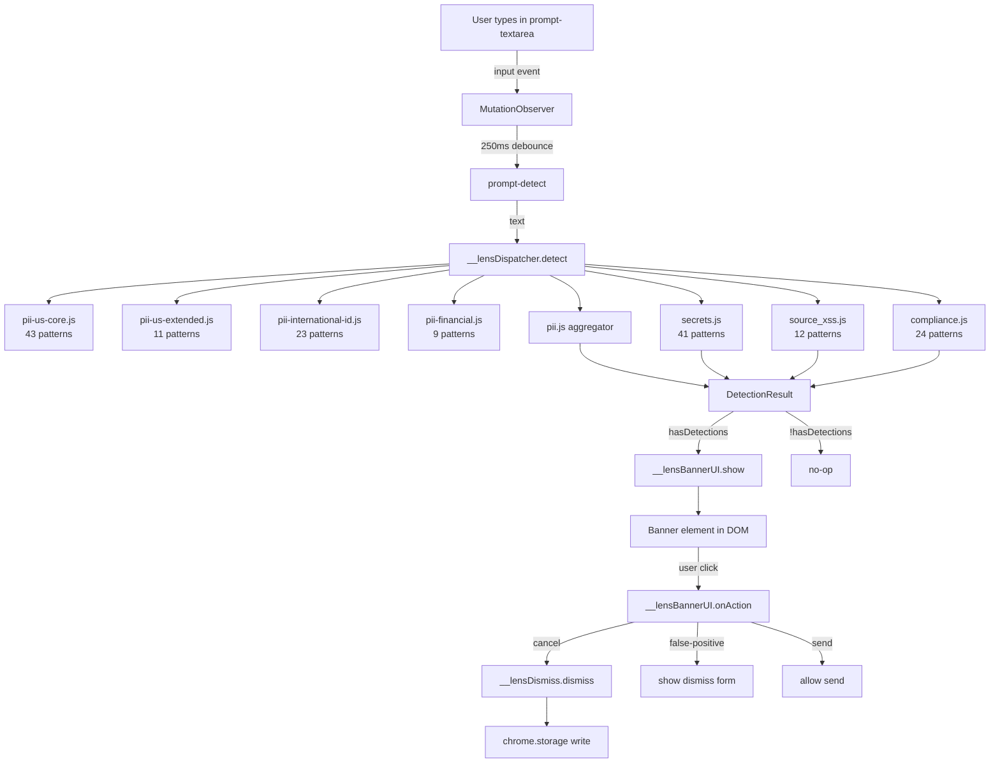
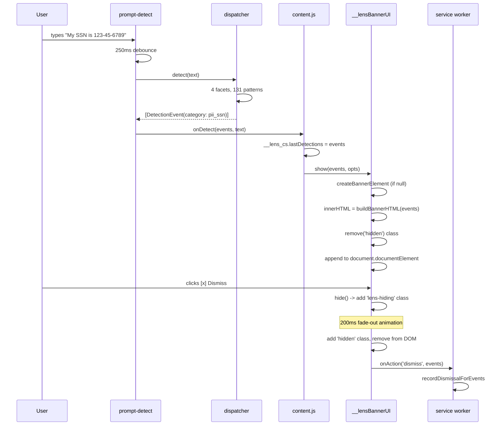
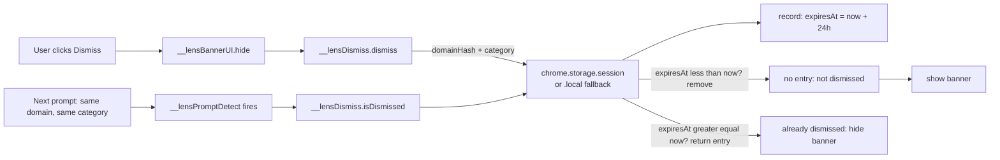
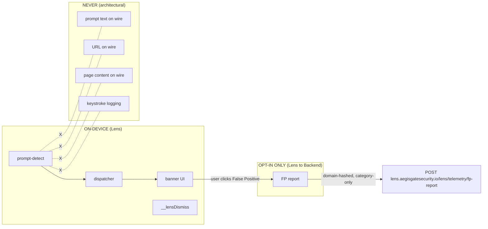
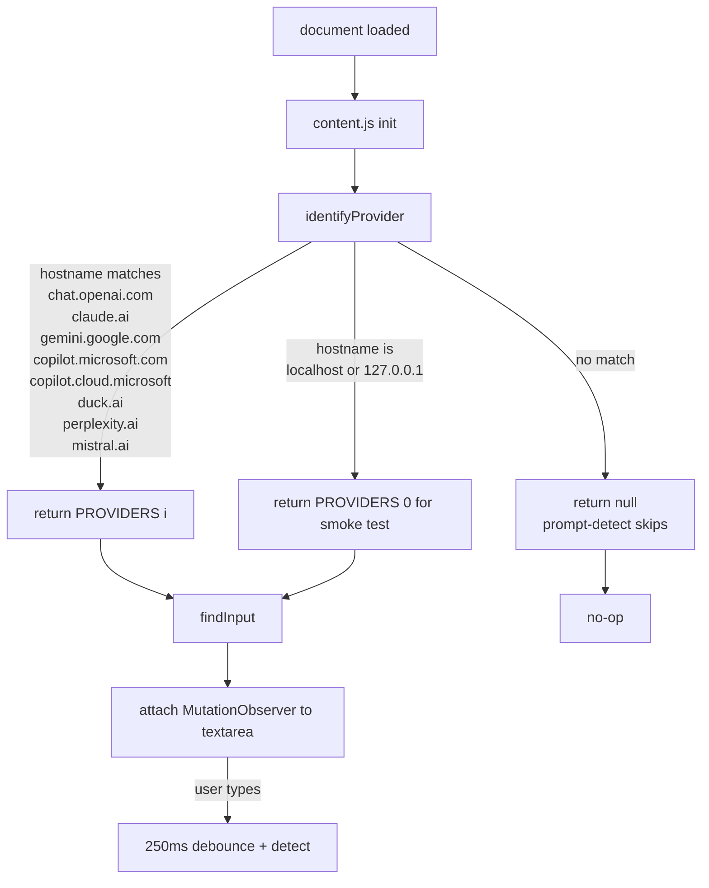

# AegisGate Lens — Architecture (v0.1.3)

**Version**: v0.1.3
**Last updated**: 2026-07-10
**Audience**: Contributors, security auditors, and technical evaluators.

> Pattern count: 131, test count: 405/405 unit
> + 3/3 Go + 16/16 smoke), and provider count (10 → 8 with localhost
> fallback for tests).

## System overview

Lens is a Chrome extension that injects a content script into
8 AI chat tool hostnames. As the user types, the content script
runs 4 regex facets against the prompt. On detection, a banner
appears at the top of the page with the category, severity, and
options (Cancel / Edit & Redact / Send Anyway / False Positive).

## Detection pipeline

## Banner show / hide flow

## Dismiss storage round-trip

## Module load order

```mermaid
graph TD
    BO[bootstrap.js<br/>module registry] --> CO[util/constants.js]
    CO --> TD[util/typedefs.js]
    TD --> LO[util/logger.js]
    LO --> LU[detectors/luhn.js]
    LU --> PI[pii-us-core.js]
    PI --> PE[pii-us-extended.js]
    PE --> PII[pii-international-id.js]
    PII --> PF[pii-financial.js]
    PF --> PIA[pii.js aggregator]
    PIA --> SE[secrets.js]
    SE --> XS[source_xss.js]
    XS --> CP[compliance.js]
    CP --> SC[privacy/schema.js]
    SC --> DH[privacy/domain_hash.js]
    DH --> DI[detectors/index.js<br/>__lensDispatcher]
    DI --> SE2[util/selectors.js]
    SE2 --> PD1[util/prompt-detect-dom.js]
    PD1 --> PD2[util/prompt-detect-lifecycle.js]
    PD2 --> PD3[util/prompt-detect.js<br/>__lensPromptDetect]
    PD3 --> BI[util/banner-icons.js]
    BI --> DM[util/dismiss.js<br/>__lensDismiss]
    DM --> BF[util/banner-ui-formatters.js]
    BF --> BH[util/banner-ui-html.js]
    BH --> BL[util/banner-ui-lifecycle.js]
    BL --> BU[util/banner-ui.js<br/>__lensBannerUI]
    BU --> CT[content.js<br/>__lens_cs]
```

## Privacy boundary

The "NEVER" column is enforced by the code, not by policy. There is
no `fetch()` call to any origin in the content script. The opt-in
FP report is the ONLY egress, and it's only invoked when the user
explicitly clicks "False Positive" on a banner.

## Provider detection

## What this document does NOT cover

- **Bundle format**: see `docs/MODEL-CARD.md`
- **Permission justifications**: see the CWS listing at
- **Threat model**: see `docs/THREAT-MODEL.md`
- **Bundle globals**: see `docs/API.md`
